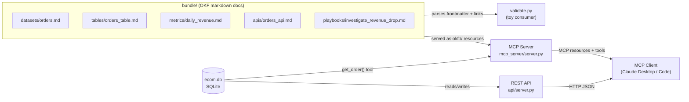
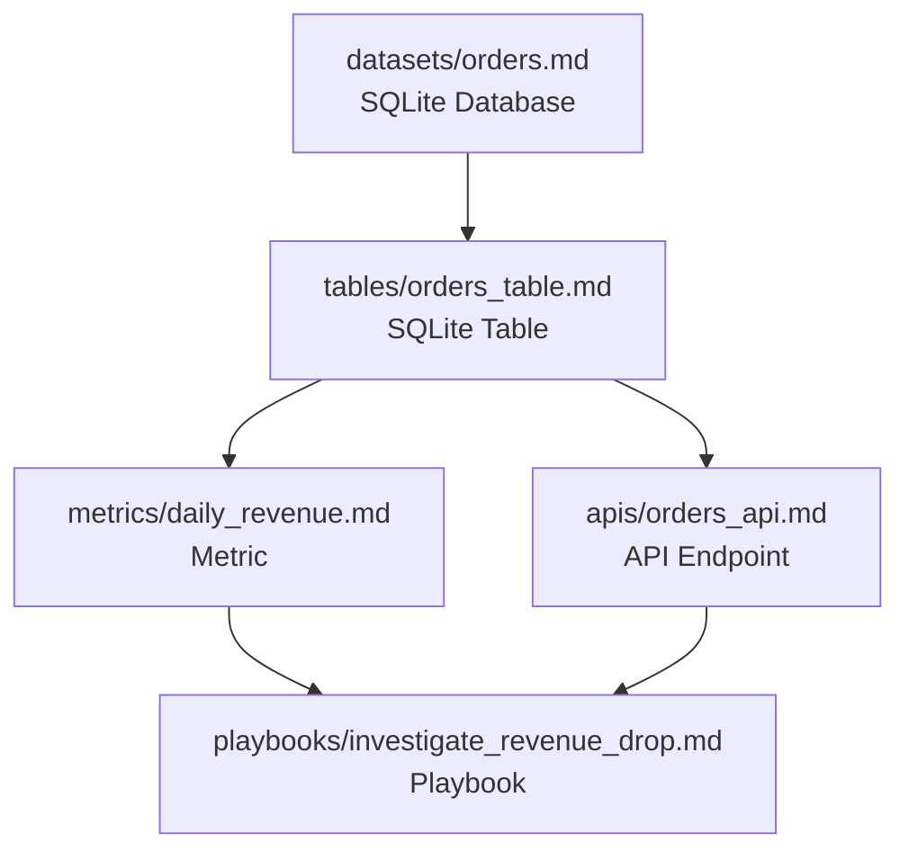

# Learning Google's Open Knowledge Format (OKF)

OKF is an open spec for representing knowledge as plain markdown files with YAML
frontmatter, organized into a directory ("bundle") and linked together into a graph —
designed so both humans and AI agents can read the same files without any special
SDK. Full spec: https://github.com/GoogleCloudPlatform/knowledge-catalog/tree/main/okf

This project has grown from a static doc sample into a small running system: a real
SQLite database, a REST API in front of it, and an MCP server that lets any MCP client
(like Claude Desktop or Claude Code) read the OKF bundle *and* query live order data.

## Architecture



## Knowledge graph

The bundle's concepts link to each other the way the real system's pieces relate —
this is what `validate.py` walks and prints:



## What's here

```
bundle/                       # OKF bundle for a fictional "orders" domain
├── index.md                  # reserved: no frontmatter, lists the bundle's contents
├── log.md                    # reserved: date-grouped changelog
├── datasets/orders.md        # type: SQLite Database
├── tables/orders_table.md    # type: SQLite Table
├── metrics/daily_revenue.md  # type: Metric
├── apis/orders_api.md        # type: API Endpoint
└── playbooks/investigate_revenue_drop.md
bundle_lib.py                 # shared frontmatter parser used by validate.py + the MCP server
validate.py                   # toy "consumer" that parses the bundle like an agent would
api/
├── db.py                     # creates + seeds ecom.db (the real orders table)
└── server.py                 # read-only REST API over ecom.db
mcp_server/
└── server.py                 # MCP server: bundle docs as resources, plus live-data tools
```

Open any file under `bundle/` to see the frontmatter + linking conventions in practice
— start at `bundle/index.md` and follow the links.

## Setup

Dependencies (`mcp`, `pyyaml`) are managed with [uv](https://docs.astral.sh/uv/):

```
uv sync
```

## Run it

```
uv run python validate.py         # parses bundle/, prints each concept's type and its links
uv run python validate.py --demo  # self-check, including a deliberately broken link

uv run python api/db.py           # create + seed ecom.db (idempotent)
uv run python api/server.py       # serves http://localhost:8000/v1/orders, /v1/orders/{id},
                                   # /v1/metrics/daily_revenue
```

### MCP server

```
uv run mcp dev mcp_server/server.py   # launch with the MCP Inspector for interactive testing
```

Or point an MCP client (Claude Desktop / Claude Code) at it directly, e.g. in
`claude_desktop_config.json`:

```json
{
  "mcpServers": {
    "okf-sample": {
      "command": "uv",
      "args": ["run", "--directory", "/absolute/path/to/okf-sample", "python", "mcp_server/server.py"]
    }
  }
}
```

It exposes:
- **Resources** `okf://<path>` — one per bundle concept file (e.g. `okf://tables/orders_table.md`)
- **Tool** `list_concepts(type=None)` — list bundle concepts, optionally filtered by type
- **Tool** `get_order(order_id)` — look up a real row from the live `ecom.db` SQLite table
