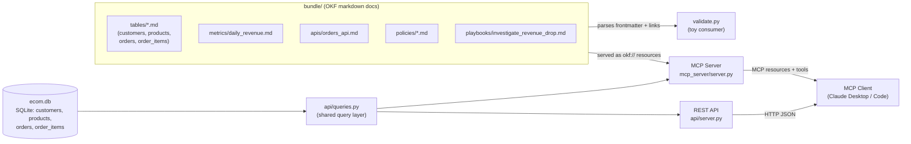
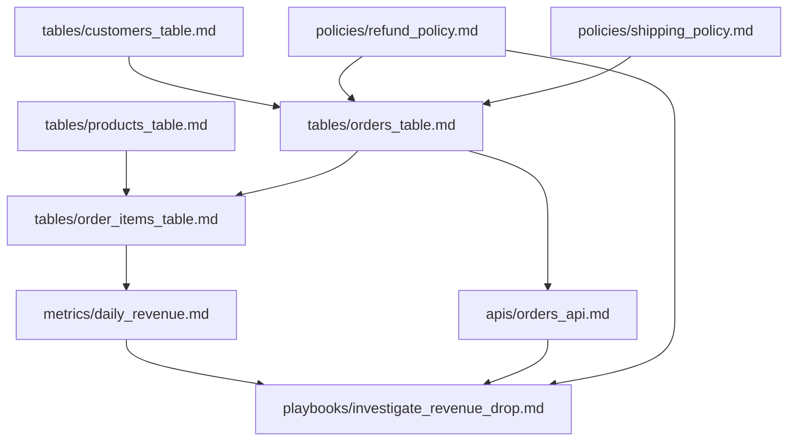

# Learning Google's Open Knowledge Format (OKF)

OKF is an open spec for representing knowledge as plain markdown files with YAML
frontmatter, organized into a directory ("bundle") and linked together into a graph —
designed so both humans and AI agents can read the same files without any special
SDK. Full spec: https://github.com/GoogleCloudPlatform/knowledge-catalog/tree/main/okf

This project has grown from a static doc sample into a small running system: a real
relational SQLite database (customers, products, orders, order_items), a REST API in
front of it, and an MCP server that lets any MCP client (like Claude Desktop or Claude
Code) read the OKF bundle *and* query live data.

## Proof it works from outside the project

The `okf-sample` MCP server was registered at user scope (`claude mcp add okf-sample
--scope user -- ...`), then queried from a Claude Code session in an unrelated directory
with no filesystem access to this repo — every answer below came from the MCP tools alone:

<video src="docs/mcp-demo.mov" controls width="900"></video>

(GitHub and other HTML-aware Markdown renderers play this inline; plain-text viewers will
just show a link to `docs/mcp-demo.mov`.)

## Architecture



## Knowledge graph

The bundle's concepts link to each other the way the real system's pieces relate —
this is what `validate.py` walks and prints:



## What's here

```
bundle/                                # OKF bundle for a fictional ecommerce domain
├── index.md                           # reserved: no frontmatter, lists the bundle's contents
├── log.md                             # reserved: date-grouped changelog
├── datasets/orders.md                 # type: SQLite Database
├── tables/
│   ├── customers_table.md             # type: SQLite Table
│   ├── products_table.md              # type: SQLite Table
│   ├── orders_table.md                # type: SQLite Table (header only)
│   └── order_items_table.md           # type: SQLite Table (line items)
├── metrics/daily_revenue.md           # type: Metric
├── apis/orders_api.md                 # type: API Endpoint
├── policies/
│   ├── refund_policy.md               # type: Policy
│   └── shipping_policy.md             # type: Policy
└── playbooks/investigate_revenue_drop.md
bundle_lib.py                          # shared frontmatter parser used by validate.py + the MCP server
validate.py                            # toy "consumer" that parses the bundle like an agent would
api/
├── db.py                              # creates + seeds ecom.db (4 tables)
├── queries.py                         # shared SQL queries, used by both server.py and the MCP server
└── server.py                          # read-only REST API over ecom.db
mcp_server/
└── server.py                          # MCP server: bundle docs as resources, plus live-data tools
```

Open any file under `bundle/` to see the frontmatter + linking conventions in practice
— start at `bundle/index.md` and follow the links.

## Setup

Dependencies (`mcp`, `pyyaml`) are managed with [uv](https://docs.astral.sh/uv/):

```
uv sync
```

## Run it

```
uv run python validate.py         # parses bundle/, prints each concept's type and its links
uv run python validate.py --demo  # self-check, including a deliberately broken link

uv run python api/db.py           # create + seed ecom.db (idempotent)
uv run python api/server.py       # serves the endpoints below on http://localhost:8000
```

REST endpoints (all read-only):
| Endpoint | Returns |
|---|---|
| `GET /v1/orders` | order list with `customer_name`, `status`, `total_usd` |
| `GET /v1/orders/{id}` | order detail incl. `items[]` and `total_usd` |
| `GET /v1/customers`, `/v1/customers/{id}` | customer rows |
| `GET /v1/products`, `/v1/products/{id}` | product catalog rows |
| `GET /v1/metrics/daily_revenue` | revenue by day, `completed` orders only |

### MCP server

```
uv run mcp dev mcp_server/server.py   # launch with the MCP Inspector for interactive testing
```

Or point an MCP client (Claude Desktop / Claude Code) at it directly, e.g. in
`claude_desktop_config.json`:

```json
{
  "mcpServers": {
    "okf-sample": {
      "command": "uv",
      "args": ["run", "--directory", "/absolute/path/to/okf-sample", "python", "mcp_server/server.py"]
    }
  }
}
```

It exposes:
- **Resources** `okf://<path>` — one per bundle concept file (e.g. `okf://tables/orders_table.md`)
- **Tool** `list_concepts(type=None)` — list bundle concepts; each entry includes the exact
  `resource_uri` to read (no need to guess the `okf://` scheme)
- **Tool** `read_concept(path)` — read one concept's markdown directly; accepts the path
  with or without `okf://`/a leading slash, so it works even if a client guesses the format
- **Tool** `list_orders()` / `get_order(order_id)` — orders (with customer + line items + total) from the live `ecom.db`
- **Tool** `list_customers()` / `get_customer(customer_id)` — customer rows
- **Tool** `list_products()` / `get_product(product_id)` — product catalog rows
